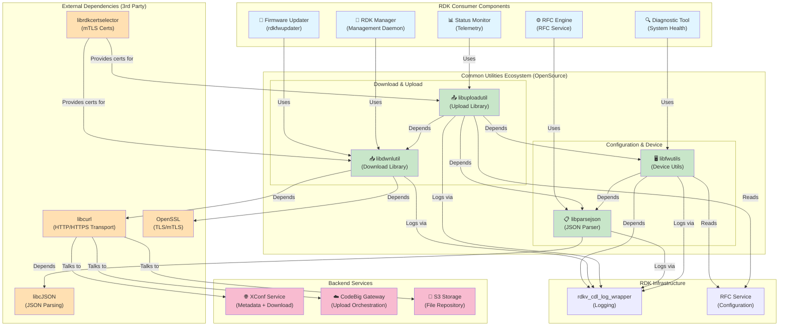
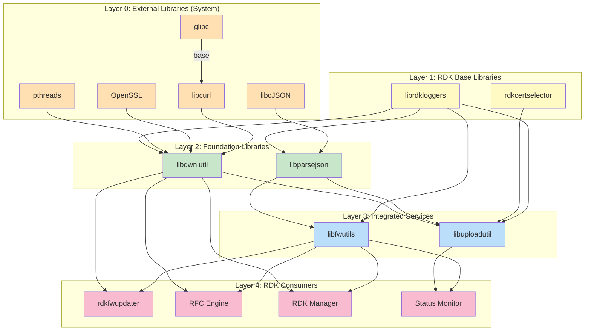
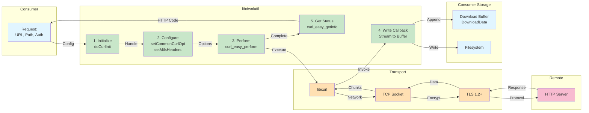
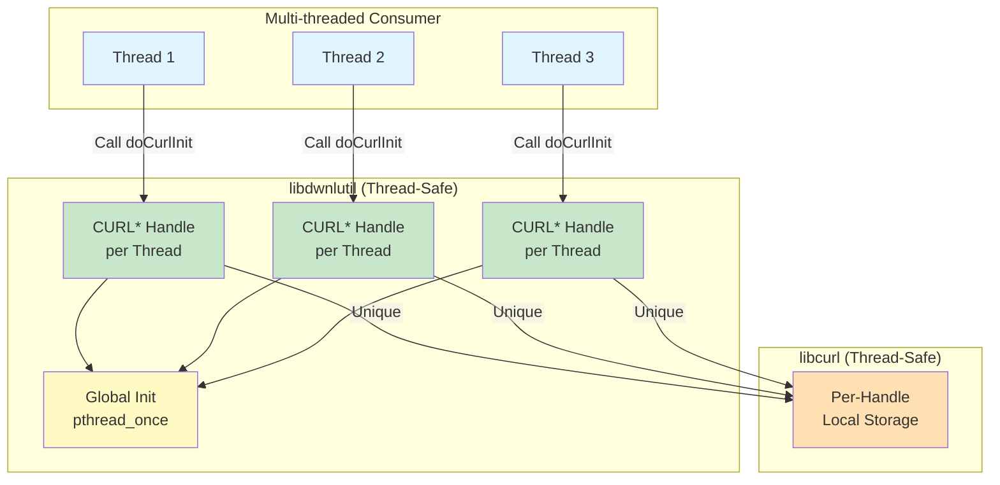
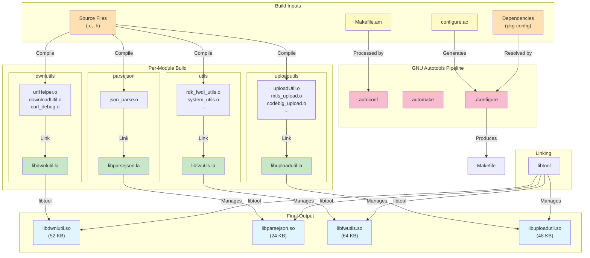
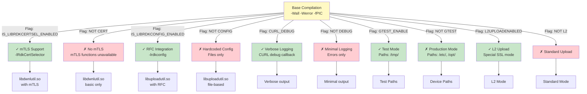

# Architecture Diagrams - Visual Analysis

**Scope:** Common Utilities Ecosystem Architecture  
**Format:** Mermaid diagrams with textual explanations

---

## Diagram 1: Complete System Architecture



---

## Diagram 2: Dependency Graph (Layered)



**Interpretation:**
- **Layer 0 (External):** Open-source dependencies (libcurl, cJSON, OpenSSL)
- **Layer 1 (RDK Base):** Logging and certification infrastructure
- **Layer 2 (Foundation):** Standalone libraries (JSON parser, download utility)
- **Layer 3 (Integration):** Combined services (upload, device utils)
- **Layer 4 (Consumers):** RDK components that use the ecosystem

---

## Diagram 3: Data Flow - Download Operation



---

## Diagram 4: Data Flow - Upload Operation

```mermaid
graph LR
    subgraph "Consumer"
        FILE_REQ["Request:<br/>File Path, Metadata"]
    end

    subgraph "Stage 1: Metadata POST"
        DISCOVER["1. Discover<br/>getCodebigCredentials"]
        BUILD["2. Build Metadata<br/>JSON Payload"]
        POST["3. POST Metadata<br/>curl_easy_perform"]
        PARSE["4. Parse Response<br/>Extract URLs"]
    end

    subgraph "Stage 2: S3 Upload"
        EXTRACT["5. Extract URL<br/>extractS3PresignedUrl"]
        OPEN["6. Open File<br/>Stream Setup"]
        PUT["7. PUT to S3<br/>curl_easy_perform"]
        VERIFY["8. Verify Status<br/>HTTP 200 Check"]
    end

    subgraph "Backend"
        METADATA_SVC["Metadata Service<br/>(CodeBig/XConf)"]
        S3_SVC["S3 Service<br/>(AWS)"]
    end

    FILE_REQ -->|Config| DISCOVER
    DISCOVER -->|Endpoint| BUILD
    BUILD -->|JSON| POST
    POST -->|Request| METADATA_SVC
    METADATA_SVC -->|Response| PARSE
    PARSE -->|URLs| EXTRACT
    EXTRACT -->|URL| OPEN
    OPEN -->|File Handle| PUT
    PUT -->|Upload| S3_SVC
    S3_SVC -->|Response| VERIFY
    VERIFY -->|Complete| FILE_REQ

    style FILE_REQ fill:#e1f5ff
    style DISCOVER fill:#bbdefb
    style BUILD fill:#bbdefb
    style POST fill:#bbdefb
    style PARSE fill:#bbdefb
    style EXTRACT fill:#c8e6c9
    style OPEN fill:#c8e6c9
    style PUT fill:#c8e6c9
    style VERIFY fill:#c8e6c9
    style METADATA_SVC fill:#f8bbd0
    style S3_SVC fill:#f8bbd0
```



---

## Diagram 5: Module Interaction Matrix

```
┌─────────────────────────────────────────────────────────────┐
│                MODULE INTERACTION MATRIX                     │
├──────────────┬──────────┬──────────┬──────────┬──────────────┤
│ From\To      │ dwnlutil │ uploadutil│ parsejson│ utils        │
├──────────────┼──────────┼──────────┼──────────┼──────────────┤
│ dwnlutil     │    —     │   ✓      │    ✗     │    ✗         │
│              │          │ (used by)│          │              │
├──────────────┼──────────┼──────────┼──────────┼──────────────┤
│ uploadutil   │    —     │    —     │    ✓     │    ✓         │
│              │          │          │ (uses)   │  (uses)      │
├──────────────┼──────────┼──────────┼──────────┼──────────────┤
│ parsejson    │    ✗     │    ✗     │    —     │    ✓         │
│              │          │          │          │ (used by)    │
├──────────────┼──────────┼──────────┼──────────┼──────────────┤
│ utils        │    ✗     │    ✗     │    ✗     │    —         │
│              │          │          │          │              │
├──────────────┼──────────┼──────────┼──────────┼──────────────┤
│ Symbols:                                                      │
│ ✓ = Direct dependency                                        │
│ ✗ = No dependency                                            │
│ — = Self (N/A)                                               │
└──────────────┴──────────┴──────────┴──────────┴──────────────┘

Call Flow:
  uploadutil → libdwnlutil (transport layer)
  uploadutil → parsejson (JSON parsing)
  uploadutil → utils (device config)
  utils → parsejson (JSON parsing)
```

---

## Diagram 6: Thread Safety Model



**Key Points:**
- Each thread must call `doCurlInit()` to get its own CURL* handle
- No global state shared between threads
- Global initialization happens once via `pthread_once`
- Safe for concurrent downloads/uploads from different threads

---

## Diagram 7: Compilation Architecture (Build System)



---

## Diagram 8: Feature Flags & Build Variants



---

## Key Observations

### Layering
- **Clean separation:** Each module has a well-defined responsibility
- **Low coupling:** Minimal cross-module dependencies
- **High cohesion:** Related functionality grouped together

### Thread Safety
- **Per-thread handles:** Each thread owns its CURL* context
- **No global state:** Library stateless (aside from init)
- **Safe for concurrent use:** Multiple threads can upload/download simultaneously

### Resource Management
- **Explicit lifecycle:** doCurlInit() / doStopDownload()
- **No implicit cleanup:** Consumer responsibility for resource release
- **Risk of leaks:** Forgotten doStopDownload() → resource leak

### Performance
- **Streaming model:** Upload streams from disk (efficient)
- **Buffering model:** Download buffers in memory (simpler API)
- **Network-bound:** Throughput limited by libcurl/network, not library

---

## References

- Module Responsibilities: [project.md](../project.md)
- Detailed Subsystem Analysis: [subsystems/](../subsystems/)
- Runtime Flows: [runtime/](../runtime/)
