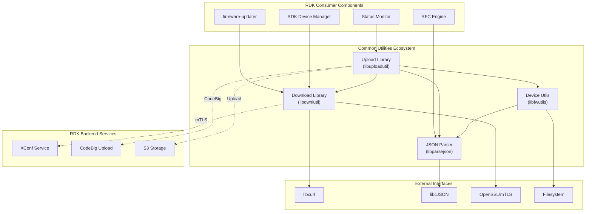

# Common Utilities Architecture Baseline

**Project:** RDK Common Utilities  
**Repository:** `common_utilities`  
**Scope:** Embedded Linux / RDK firmware management infrastructure  
**Status:** Production-grade brownfield codebase  
**Last Updated:** 2026-07-03

---

## Executive Summary

**common_utilities** is a production-grade, foundational library ecosystem that provides critical network I/O, data transformation, and device discovery capabilities for RDK (Realtime Decoding Kit) firmware management systems.

The project consists of four interdependent shared libraries that collectively enable firmware downloading, uploading, device configuration management, and JSON-based data processing. These libraries are consumed by higher-level RDK components including firmware updaters, remote management systems, and configuration frameworks.

### Key Characteristics
- **Maturity:** Production (v1.5.5+)
- **Architecture:** Layered, modular C libraries with clear separation of concerns
- **Integration Model:** Shared libraries with static/dynamic linking
- **Platform:** Embedded Linux/RDK (cross-compiled ARM targets)
- **Dependencies:** libcurl (network I/O), cJSON (JSON parsing), OpenSSL/mTLS (secure transport)
- **Build System:** GNU Autotools (autoconf/automake)

---

## System Purpose

**common_utilities** is designed to provide **reusable, production-hardened building blocks** for RDK system components that must:

1. **Download firmware/content** reliably from remote servers with:
   - mTLS certificate-based authentication
   - OAuth token-based authorization  
   - Bandwidth throttling and resumable downloads
   - Chunk-based downloads with retry logic

2. **Upload device data and status** to backend systems with:
   - Two-stage metadata submission + file upload workflows
   - S3 pre-signed URL support (CodeBig protocol)
   - mTLS certificate rotation
   - Content hash tracking and verification

3. **Parse and transform configuration data** from:
   - JSON-formatted configuration files
   - Device property files
   - RFC (Remote Feature Configuration) manifests

4. **Query device state and capabilities** by reading:
   - System property files (`/etc/device.properties`)
   - Bootstrap configuration (`/opt/secure/RFC/bootstrap.ini`)
   - Device identity and firmware version files
   - Network configuration

---

## Architectural Overview

### High-Level System Architecture



### Modular Decomposition

The ecosystem comprises four independent shared libraries with clear responsibilities:

| Library | Responsibility | Public API | External Dependencies |
|---------|-----------------|-----------|----------------------|
| **libdwnlutil** (dwnlutils/) | HTTP/HTTPS file download with resilience features | `downloadUtil.h` | libcurl, pthreads, mTLS (optional) |
| **libuploadutil** (uploadutils/) | HTTP/S3 file upload with metadata management | `uploadUtil.h` | libdwnlutil, libfwutils, libcurl |
| **libparsejson** (parsejson/) | JSON parsing and environment variable binding | `json_parse.h` | libcJSON |
| **libfwutils** (utils/) | Device state queries, system utilities, configuration access | `common_device_api.h`, `rdk_fwdl_utils.h`, `system_utils.h` | libparsejson, filesystem I/O |

### Dependency Graph

```
libuploadutil.la
├── libdwnlutil.la
│   ├── libcurl ⭐
│   ├── pthreads
│   └── rdkloggers
├── libfwutils.la
│   ├── libparsejson.la
│   │   └── libcJSON ⭐
│   └── rdkloggers
├── librdkloggers
└── Optional: librdkcertselector (mTLS)

libdwnlutil.la (leaf)
├── libcurl ⭐
├── pthreads
└── rdkloggers

libparsejson.la (leaf)
├── libcJSON ⭐
└── rdkloggers

libfwutils.la (independent)
├── libparsejson.la
└── rdkloggers
```

**Key:** ⭐ = External open-source dependency

---

## Runtime Models

### 1. Download Operation Model

```
┌──────────────────────────────────────────────────────────┐
│ Consumer: FW Updater, RFC Engine, RDK Manager            │
└──────────────────────────────────────────────────────────┘
                          │
                          ▼
┌──────────────────────────────────────────────────────────┐
│ Download Library (libdwnlutil)                           │
│                                                          │
│  [doHttpFileDownload] ◄── Consumer API                   │
│      ├─ curl initialization (doCurlInit)                │
│      ├─ mTLS auth handling (MtlsAuth_t)                 │
│      ├─ URL + file path resolution                      │
│      ├─ Progressive download (callback-based)           │
│      ├─ Bandwidth throttling (doInteruptDwnl)           │
│      └─ Download byte tracking (doGetDwnlBytes)         │
│                                                          │
│  [urlHelper layer] ◄── Internal implementation          │
│      ├─ curl option configuration                       │
│      ├─ HTTP header management                          │
│      ├─ SSL/TLS verification (configurable)             │
│      └─ Connection lifecycle                            │
└──────────────────────────────────────────────────────────┘
                          │
                          ▼
┌──────────────────────────────────────────────────────────┐
│ libcurl (HTTP/HTTPS I/O + mTLS transport)               │
│ ├─ Protocol handling (HTTP/1.1, TLS 1.2+)              │
│ ├─ Certificate validation                               │
│ └─ Socket-level I/O                                     │
└──────────────────────────────────────────────────────────┘
                          │
                          ▼
┌──────────────────────────────────────────────────────────┐
│ Remote Server (XConf, CodeBig, Direct HTTP/S)           │
└──────────────────────────────────────────────────────────┘
```

**Runtime State Machine:**

```
[Idle] 
  ↓ doCurlInit()
[Initialized] 
  ↓ doHttpFileDownload() / doAuthHttpFileDownload()
[Downloading]
  ├─ doGetDwnlBytes() [→ Downloading] (progress tracking)
  ├─ doInteruptDwnl() [→ Throttled] (speed limiting)
  └─ getJsonRpcData() [→ Downloading] (JSON RPC mode)
  ↓ (completion)
[Complete]
  ↓ doStopDownload()
[Destroyed]
```

### 2. Upload Operation Model

```
┌──────────────────────────────────────────────────────────┐
│ Consumer: Status Monitor, Telemetry, RDK Manager         │
└──────────────────────────────────────────────────────────┘
                          │
                          ▼
┌──────────────────────────────────────────────────────────┐
│ Upload Library (libuploadutil)                           │
│                                                          │
│  Two-Stage Upload Workflow:                             │
│                                                          │
│  Stage 1: Metadata POST                                  │
│  ├─ Endpoint: Backend HTTP service                       │
│  ├─ Payload: JSON metadata + file details                │
│  ├─ Auth: Bearer token or mTLS cert                      │
│  └─ Response: S3 pre-signed URL (CodeBig)               │
│                                                          │
│  Stage 2: S3 PUT Upload                                  │
│  ├─ Endpoint: S3 service (via pre-signed URL)           │
│  ├─ Payload: Binary file content                         │
│  ├─ Auth: mTLS + presigned URL parameters               │
│  └─ Response: HTTP 200 OK                                │
│                                                          │
│  Credential Management:                                  │
│  ├─ mtls_upload.c: Certificate rotation (rdkcertselector)│
│  ├─ codebig_upload.c: CodeBig protocol handler          │
│  └─ upload_status.c: Upload state tracking              │
└──────────────────────────────────────────────────────────┘
                          │
                          ▼
┌──────────────────────────────────────────────────────────┐
│ libcurl + Download Library (reused for transport)        │
└──────────────────────────────────────────────────────────┘
                          │
                          ▼
┌──────────────────────────────────────────────────────────┐
│ Backend Services:                                        │
│ ├─ XConf service (metadata POST)                         │
│ ├─ CodeBig gateway (S3 orchestration)                    │
│ └─ S3 storage (file repository)                          │
└──────────────────────────────────────────────────────────┘
```

### 3. Device State Query Model

```
┌──────────────────────────────────────────────────────────┐
│ Consumer: Any RDK component                              │
└──────────────────────────────────────────────────────────┘
                          │
                          ▼
┌──────────────────────────────────────────────────────────┐
│ Device Utils Library (libfwutils)                        │
│                                                          │
│  [Get Device Properties]                                 │
│  ├─ GetAccountID()                                       │
│  ├─ GetModelNum()                                        │
│  ├─ GetDeviceType()                                      │
│  └─ getDeviceProperties() [returns DeviceProperty_t]    │
│                                                          │
│  [Get Image Details]                                     │
│  ├─ GetVersionNum()                                      │
│  ├─ GetImageDetails() [returns ImageDetails_t]          │
│  └─ getImageUpdateFrequency()                            │
│                                                          │
│  [System Utilities]                                      │
│  ├─ cmdExec() - Execute shell commands                  │
│  ├─ filePresentCheck() - File existence                 │
│  ├─ getFileSize() - File metrics                        │
│  └─ Filesystem operations (find, copy, tar, etc.)       │
└──────────────────────────────────────────────────────────┘
                          │
                          ▼
┌──────────────────────────────────────────────────────────┐
│ Filesystem Layer (Linux VFS)                             │
│                                                          │
│ Configuration Files:                                     │
│ ├─ /etc/device.properties (device metadata)             │
│ ├─ /version.txt (firmware version)                      │
│ ├─ /opt/secure/RFC/bootstrap.ini (bootstrap config)     │
│ ├─ /opt/www/authService/partnerId3.dat (partner ID)    │
│ └─ /tmp/.estb_mac (device MAC address)                  │
└──────────────────────────────────────────────────────────┘
```

---

## Process Relationships

### Consumer Integration Patterns

**Pattern 1: Simple File Download**
```c
// Consumer code pattern
CURL *curl = doCurlInit();              // Obtain curl context
FileDwnl_t download_spec = {...};       // Configure download
int http_code = 0;
int result = doHttpFileDownload(
    curl, 
    &download_spec,      // URL, file path, SSL settings
    &mtls_auth,          // Optional mTLS credentials
    256 * 1024,          // Max download speed (bytes/sec)
    NULL,                // Resume offset (NULL = start fresh)
    &http_code           // HTTP status output
);
doStopDownload(curl);                   // Cleanup
```

**Pattern 2: Two-Stage Upload with S3**
```c
// Stage 1: POST metadata to backend
FileUpload_t metadata = {...};          // Configure POST payload
int http_code = 0;
int result = performMetadataPost(
    curl, 
    metadata,
    "s3_urls.txt"        // Output file with pre-signed URLs
);

// Stage 2: PUT to S3
char s3_url[512];
extractS3PresignedUrl("s3_urls.txt", s3_url, sizeof(s3_url));
result = performS3PutUpload(s3_url, "/local/file.bin", &mtls_auth);
```

**Pattern 3: Device Configuration Query**
```c
// Get device metadata
DeviceProperty_t props = {0};
getDeviceProperties(&props);             // Reads /etc/device.properties
char account_id[64];
GetAccountID(account_id, sizeof(account_id));

// Get firmware version
ImageDetails_t img = {0};
getImageDetails(&img);                   // Reads /version.txt
```

---

## Subsystem Architecture Details

Detailed architecture analysis for each module:

### [Download Library (libdwnlutil)](subsystems/dwnlutils.md)
- Curl wrapper layer design
- Download state management
- mTLS certificate handling
- Bandwidth throttling mechanism
- Resumable download support

### [Upload Library (libuploadutil)](subsystems/uploadutils.md)
- Two-stage upload workflow
- S3 pre-signed URL handling
- Certificate rotation with rdkcertselector
- CodeBig protocol integration
- Upload status tracking

### [JSON Parser (libparsejson)](subsystems/parsejson.md)
- cJSON wrapper interface
- Environment variable binding
- Memory management patterns
- File-to-environment variable workflow

### [Device Utils (libfwutils)](subsystems/utils.md)
- Filesystem configuration readers
- Device property parsing
- System utility collection
- Platform-specific path handling

---

## Runtime Flow Documentation

Detailed sequence diagrams and operational flows:

### [Download Sequence Flows](runtime/download_flows.md)
- Standard file download sequence
- OAuth authorization flow
- JSON-RPC communication flow
- Error handling and retry logic

### [Upload Sequence Flows](runtime/upload_flows.md)
- Metadata POST + S3 PUT workflow
- Certificate rotation during upload
- Error recovery scenarios

---

## Diagram Library

Visual representations of module interactions:

- [Dependency Graph](diagrams/dependency_graph.md)
- [Module Interaction Diagram](diagrams/module_interactions.md)
- [Data Flow Diagram](diagrams/data_flow.md)

---

## Technical Characteristics

### Compilation Model
- **Build System:** GNU Autotools (autoconf/automake)
- **Output Artifacts:** 4 shared libraries (`.la` → `.so` on Linux)
  - `libdwnlutil.so` - Download utilities
  - `libuploadutil.so` - Upload utilities  
  - `libparsejson.so` - JSON parser
  - `libfwutils.so` - Device/system utilities
- **Linking:** Dynamic linking (with optional static fallback)
- **Platform Flags:**
  - `-D_ANSC_LINUX` - Linux target
  - `-D_ANSC_LITTLE_ENDIAN_` - Endianness
  - `-fPIC` - Position-independent code for shared libraries

### Configuration Flags (Feature Detection)
```makefile
IS_LIBRDKCERTSEL_ENABLED    # Enable rdkcertselector for mTLS
USE_CPC_CODE                # Use alternate CodeBig implementation
IS_LIBRDKCONFIG_ENABLED     # Enable rdkconfig integration
LIBRDKCERTSEL_FLAG          # Certificate selector feature flag
L2UPLOADENABLED             # L2 container upload support
CURL_DEBUG                  # Verbose curl debugging
GTEST_ENABLE               # Google Test framework integration
```

### Threading Model
- **libdwnlutil:** Thread-safe curl handles (one CURL* per thread)
- **libuploadutil:** Multi-stage operations (sequential POST → PUT)
- **pthreads:** Used for concurrent downloads/uploads
- **No global state:** Libraries designed for multi-threaded consumers

### Logging
- **Infrastructure:** `rdkv_cdl_log_wrapper.h`
- **Levels:** ERROR, INFO, DEBUG
- **Integration:** ANSC logging framework
- **Macro Set:**
  - `COMMONUTILITIES_ERROR(format, ...)`
  - `COMMONUTILITIES_INFO(format, ...)`

### Error Handling
- **Return Codes:** Integer status codes (0=success, negative=failure)
- **cURL Errors:** `CURLcode` from libcurl propagated
- **HTTP Status:** Returned via `int *out_httpCode` parameter
- **Memory:** Explicit allocation/deallocation (no automatic cleanup)

---

## Known Gaps and Unknowns

### Areas Requiring Clarification

**Fact** - The `urlHelperPutReuqest()` function name contains a typo ("Reuqest" vs "Request")
- **Impact:** Public API inconsistency
- **Status:** Used in 22+ locations across codebase
- **Action Needed:** Requires coordinated rename across consumers

**Assumption** - mTLS is conditionally compiled (IS_LIBRDKCERTSEL_ENABLED)
- **Actual behavior:** Need to verify compile-time flag propagation to dependent libraries
- **Risk:** API availability mismatch between consumers and compiled binary

**Unknown** - OAuth token refresh strategy in `doAuthHttpFileDownload()`
- **Behavior:** Token expiration handling not documented
- **Implication:** Long-running downloads may fail mid-operation if token expires

**Unknown** - Bandwidth throttling implementation (`doInteruptDwnl()`)
- **Mechanism:** Uses `CURLPAUSE_ALL` + `curl_easy_pause()` with `setThrottleMode()`
- **Limitation:** Applies to active downloads only; doesn't affect already-scheduled connections

**Assumption** - Device property file format (`/etc/device.properties`)
- **Format:** Expected as key=value pairs or INI-style?
- **Encoding:** ASCII, UTF-8?
- **Validation:** No documented schema for property values

### Areas for Future Enhancement

1. **Error Context:** Currently returns integer codes; could benefit from detailed error messages or exception-style callbacks
2. **Configuration Schemas:** Device property files lack documented schema specification
3. **API Versioning:** No semantic versioning markers in header files
4. **Backward Compatibility:** No explicit compatibility guarantees between releases
5. **Performance Metrics:** No built-in metrics collection (upload speed, download throughput)

---

## Design Principles

### Observed Architectural Patterns

1. **Separation of Concerns**
   - Public API (`downloadUtil.h`) isolated from implementation (`urlHelper.c`)
   - Each library has single primary responsibility
   - Clear layering: application → library → libcurl/libcjson

2. **Resource Lifecycle Management**
   - Explicit init/destroy pairs (`doCurlInit()` / `doStopDownload()`)
   - Consumer responsible for resource cleanup
   - No automatic cleanup on error conditions

3. **Configuration via Structures**
   - `FileDwnl_t` - Download parameters
   - `FileUpload_t` - Upload parameters
   - `MtlsAuth_t` - Authentication credentials
   - `DownloadData` - Buffer management
   - Enables flexible, extensible configuration

4. **Optional Feature Gating**
   - Compile-time flags for mTLS, CodeBig, debug modes
   - Graceful degradation when optional features absent
   - No runtime feature detection (compile-time only)

5. **Symmetric Read/Write Patterns**
   - Download library: read from network → write to filesystem
   - Upload library: read from filesystem → write to network
   - Mirrored buffer management structures

---

## Integration Requirements for Consumers

### Compilation
- Link against `-ldwnlutil`, `-luploadutil`, `-lparsejson`, `-lfwutils`
- Include paths: `/usr/include/` (post-install)
- Dependency on `-lcurl`, `-lcjson`, `-lrdkloggers`

### Runtime
- RDK logging infrastructure must be initialized
- Filesystem access to `/etc/`, `/opt/`, `/tmp/` directories
- For mTLS: rdkcertselector daemon must be running
- For CodeBig: Backend service endpoints must be reachable

### Threading
- Safe to call from multiple threads with separate CURL* handles
- No global state to synchronize
- Consumers must manage thread safety of output buffers

---

## Verification and Testing

### Test Infrastructure
- **Unit Tests:** Google Test framework (gtest + gmock)
- **Functional Tests:** BDD-style Python test suite
- **Test Coverage:** Download, upload, JSON parsing, device queries
- **Location:** `unit-test/` and `test/functional-tests/`

### Known Test Categories
- URL helper operations (10+ test cases)
- Download utilities (file download, resume, throttle, chunk)
- Upload utilities (metadata POST, S3 PUT, certificate rotation)
- JSON parsing (parsing, environment binding)
- Device property queries

---

## Deployment Considerations

### Package Artifacts
```
/usr/lib/
├── libdwnlutil.so          (52KB, typical)
├── libuploadutil.so        (48KB, typical)
├── libparsejson.so         (24KB, typical)
└── libfwutils.so           (64KB, typical)

/usr/include/
├── downloadUtil.h
├── uploadUtil.h
├── json_parse.h
├── common_device_api.h
├── rdk_fwdl_utils.h
└── system_utils.h
```

### System Requirements
- **OS:** Embedded Linux (ARM/x86)
- **Kernel:** 2.6+ (standard RDK deployment)
- **libc:** glibc or musl
- **SSL/TLS:** OpenSSL 1.1+
- **Architecture:** Little-endian (ARM typical)

### Configuration Files (Read-Only)
- `/etc/device.properties` - Device identity
- `/version.txt` - Firmware version
- `/opt/secure/RFC/bootstrap.ini` - Bootstrap config
- `/opt/www/authService/partnerId3.dat` - Partner ID
- `/etc/timeZone_offset_map` - Timezone mappings

### Runtime Paths (Write-Capable)
- `/tmp/` - Temporary files, download caches
- `/opt/persistent/` - Persistent configuration
- `/opt/curl_progress` - Download progress file

---

## Reference Documentation

- [Detailed Module Analysis - dwnlutils](subsystems/dwnlutils.md)
- [Detailed Module Analysis - uploadutils](subsystems/uploadutils.md)
- [Detailed Module Analysis - parsejson](subsystems/parsejson.md)
- [Detailed Module Analysis - utils](subsystems/utils.md)
- [Download Operation Sequences](runtime/download_flows.md)
- [Upload Operation Sequences](runtime/upload_flows.md)
- [Visual Architecture Diagrams](diagrams/)

---

## Document Metadata

| Property | Value |
|----------|-------|
| Architecture Version | 1.0 |
| Repository Version | 1.5.5+ |
| Created | 2026-07-03 |
| Codebase State | Production (v1.5.5) |
| Completeness | Baseline Architecture (OpenSpec-ready) |
| Next Step | Create OpenSpec changes for architectural improvements |
