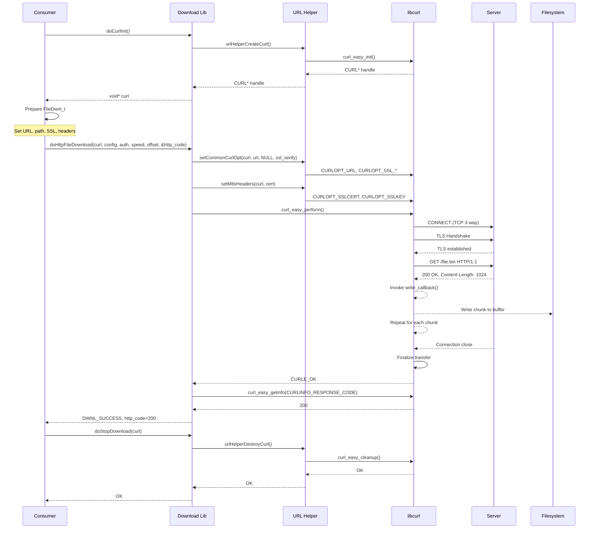
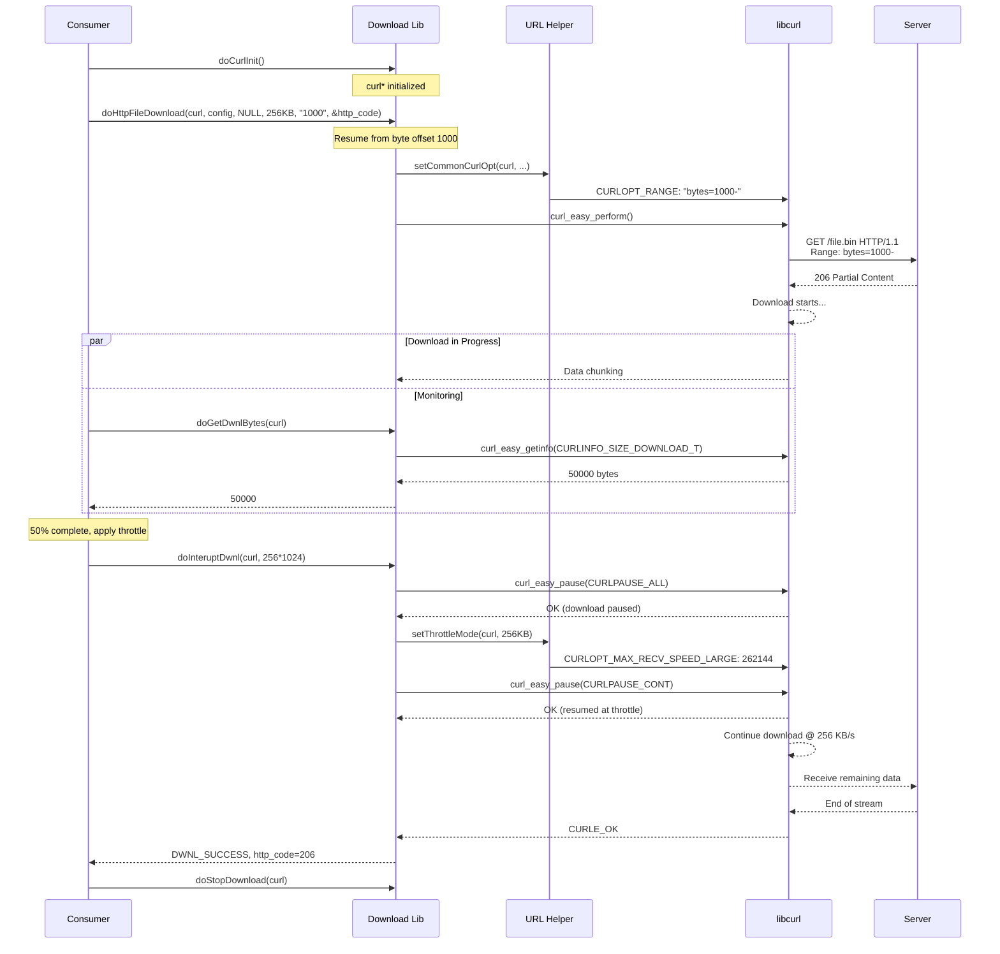
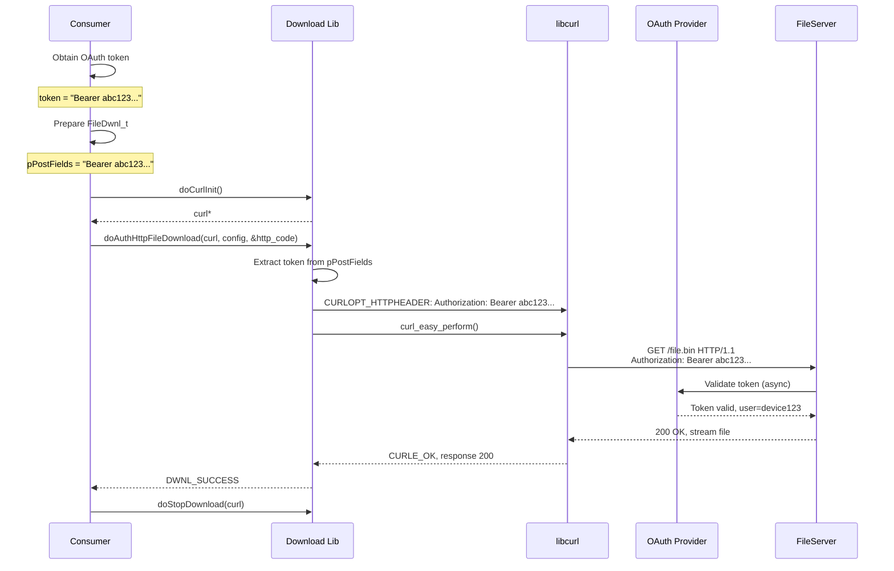
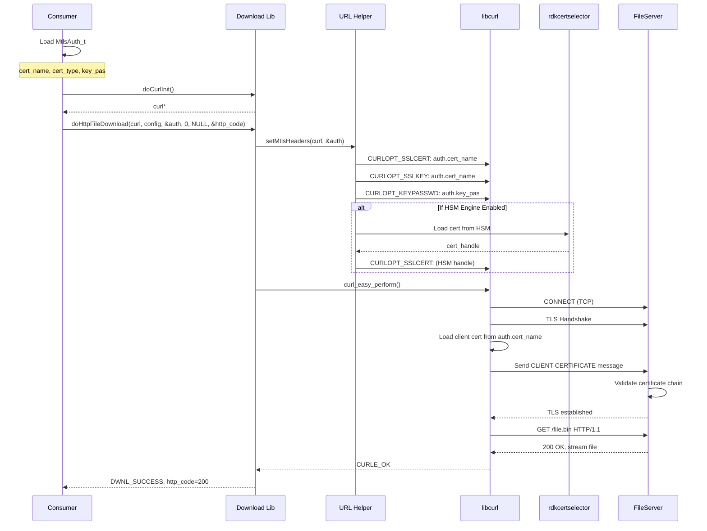
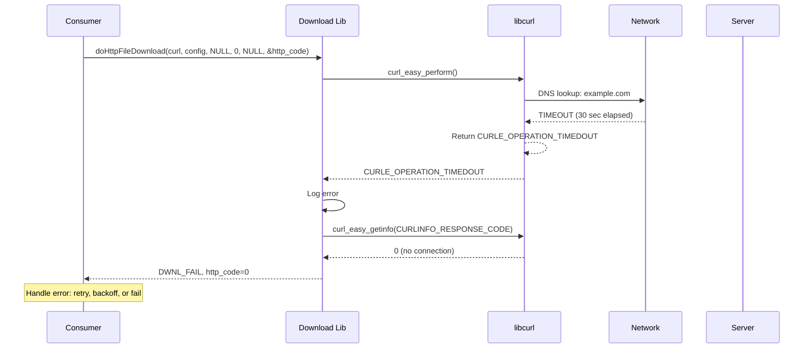

# Download Operation Sequences - Runtime Flows

**Module:** dwnlutils - Download Library  
**Scope:** HTTP/HTTPS file download with optional mTLS and resumable transfers

---

## Sequence Diagram: Standard File Download



---

## Sequence Diagram: Resumable Download (With Bandwidth Throttling)



---

## Sequence Diagram: OAuth-Based Download



---

## Sequence Diagram: mTLS Download



---

## Sequence Diagram: Error Scenario - Connection Timeout



---

## State Machine: Download Session Lifecycle

```
┌─────────────────────────────────────────────────────────────┐
│                      DOWNLOAD SESSION                        │
└─────────────────────────────────────────────────────────────┘

[INIT]
  │
  └─> doCurlInit()
      ├─> curl_global_init() [once]
      ├─> curl_easy_init()
      └─> curl* handle created
          │
          ▼
[READY]
  │
  ├─> Consumer sets up FileDwnl_t config
  │   (URL, file path, SSL settings, headers)
  │
  └─> Consumer calls doHttpFileDownload()
      │
      ▼
[CONNECTING]
  │
  ├─> setCommonCurlOpt()
  │   ├─> CURLOPT_URL
  │   ├─> CURLOPT_CONNECTTIMEOUT = 30s
  │   ├─> CURLOPT_TIMEOUT = 7200s
  │   └─> CURLOPT_SSL_VERIFYPEER
  │
  ├─> setMtlsHeaders() [if auth provided]
  │   ├─> CURLOPT_SSLCERT
  │   └─> CURLOPT_SSLKEY
  │
  └─> curl_easy_perform()
      │
      ├─ DNS Resolution
      ├─ TCP Connect (socket)
      ├─ TLS Handshake (if HTTPS)
      └─ HTTP Request Send
          │
          ▼
[DOWNLOADING]
  │
  ├─> libcurl write_callback() invoked per chunk
  │   └─> Consumer DownloadData buffer populated
  │
  ├─> doGetDwnlBytes() can query progress
  │
  ├─> doInteruptDwnl() can apply throttling
  │   ├─> curl_easy_pause(CURLPAUSE_ALL)
  │   ├─> setThrottleMode()
  │   └─> curl_easy_pause(CURLPAUSE_CONT)
  │
  └─> curl_easy_perform() continues
      │
      ├─ Server sends response body
      ├─ libcurl writes to callback
      └─ Final chunk received
          │
          ▼
[COMPLETE/ERROR]
  │
  ├─> CURLE_OK → DWNL_SUCCESS
  │   └─> HTTP code available (200, 206, etc.)
  │
  ├─> CURLcode error → DWNL_FAIL
  │   ├─ CURLE_OPERATION_TIMEDOUT
  │   ├─ CURLE_SSL_CERTPROBLEM
  │   ├─ CURLE_COULDNT_CONNECT
  │   └─ [other libcurl errors]
  │
  └─> doStopDownload()
      ├─> urlHelperDestroyCurl()
      ├─> curl_easy_cleanup()
      └─ Sockets closed, memory freed
          │
          ▼
[DESTROYED]
```

---

## Error Recovery Patterns

### Pattern 1: Retry with Exponential Backoff

```c
int download_with_retry(
    const char *url, 
    const char *output_file, 
    int max_retries
) {
    for (int attempt = 0; attempt < max_retries; attempt++) {
        CURL *curl = doCurlInit();
        if (!curl) continue;
        
        FileDwnl_t config = {0};
        strcpy(config.url, url);
        strcpy(config.pathname, output_file);
        
        int http_code = 0;
        int result = doHttpFileDownload(curl, &config, NULL, 0, NULL, &http_code);
        
        doStopDownload(curl);
        
        if (result == DWNL_SUCCESS && http_code == 200) {
            return 0;  // Success
        }
        
        if (attempt < max_retries - 1) {
            int backoff_ms = 1000 * (1 << attempt);  // 1s, 2s, 4s, ...
            usleep(backoff_ms * 1000);
        }
    }
    
    return -1;  // Failed after retries
}
```

### Pattern 2: Resumable Download After Failure

```c
int download_resumable(const char *url, const char *output_file) {
    CURL *curl = doCurlInit();
    char resume_offset[32] = "0";
    
    // Check if partial file exists
    if (filePresentCheck(output_file)) {
        int partial_size = getFileSize(output_file);
        snprintf(resume_offset, sizeof(resume_offset), "%d", partial_size);
    }
    
    FileDwnl_t config = {0};
    strcpy(config.url, url);
    strcpy(config.pathname, output_file);
    
    int http_code = 0;
    int result = doHttpFileDownload(curl, &config, NULL, 0, resume_offset, &http_code);
    
    doStopDownload(curl);
    
    if (result == DWNL_SUCCESS && http_code == 206) {
        // 206 Partial Content - resume successful
        return 0;
    } else if (result == DWNL_SUCCESS && http_code == 200) {
        // 200 OK - fresh download
        return 0;
    }
    
    return -1;
}
```

---

## Performance Timeline: Large File Download

```
Timeline (seconds):
0    │ doCurlInit()
     │
5    │ curl_easy_perform() starts
     │ ├─ DNS resolution
     │ ├─ TCP connection
     │ ├─ TLS handshake
     │ └─ HTTP GET sent
     │
10   │ First data chunk received
     │ Throughput: ~10 MB/s (network dependent)
     │
15   │ doGetDwnlBytes() → 50 MB downloaded (progress)
     │
30   │ doInteruptDwnl() called
     │ ├─ curl_easy_pause(CURLPAUSE_ALL)
     │ ├─ Throttle set to 256 KB/s
     │ ├─ curl_easy_pause(CURLPAUSE_CONT)
     │ └─ Throughput now: 256 KB/s (throttled)
     │
65   │ doGetDwnlBytes() → 100 MB downloaded
     │
120  │ Final chunk received
     │ Total: ~200 MB file
     │ Time: ~115 seconds (120 - 5 for handshake)
     │ Effective throughput: ~1.7 MB/s (including throttle)
     │
121  │ curl_easy_perform() returns CURLE_OK
     │ http_code = 200
     │
122  │ doStopDownload() called
     │ Cleanup complete
     │
Total operation time: ~122 seconds
```

---

## Memory Usage Timeline

```
Memory utilization during download:

Phase 1: Initialization (doCurlInit)
├─ libcurl handle: ~8 KB
├─ SSL context: ~16 KB
└─ Internal buffers: ~32 KB
   Total: ~56 KB

Phase 2: Download setup (setCommonCurlOpt, setMtlsHeaders)
├─ cURL options: ~4 KB
├─ Header strings: ~2 KB
└─ (No significant increase)
   Total: ~60 KB

Phase 3: Downloading (write_callback invoked)
├─ libcurl internal buffers: ~64 KB
├─ Consumer DownloadData buffer: Variable (consumer-managed)
│  (Consumer is responsible for this - can be 1 MB, 100 MB, etc.)
├─ SSL session cache: ~16 KB
└─ Total (excluding consumer buffer): ~80+ KB
   Total (with 100 MB consumer buffer): ~100 MB+

Phase 4: Cleanup (doStopDownload)
├─ SSL context freed
├─ Socket buffers freed
├─ libcurl handle freed
└─ Total freed: ~60 KB
   Remaining: 0 KB
```

---

## References

- libcurl Performance Tips: https://curl.se/libcurl/c/libcurl-tutorial.html
- CURL Error Codes: https://curl.se/libcurl/c/libcurl-errors.html
- HTTP Resume Capability: RFC 7233 (Range Requests)
