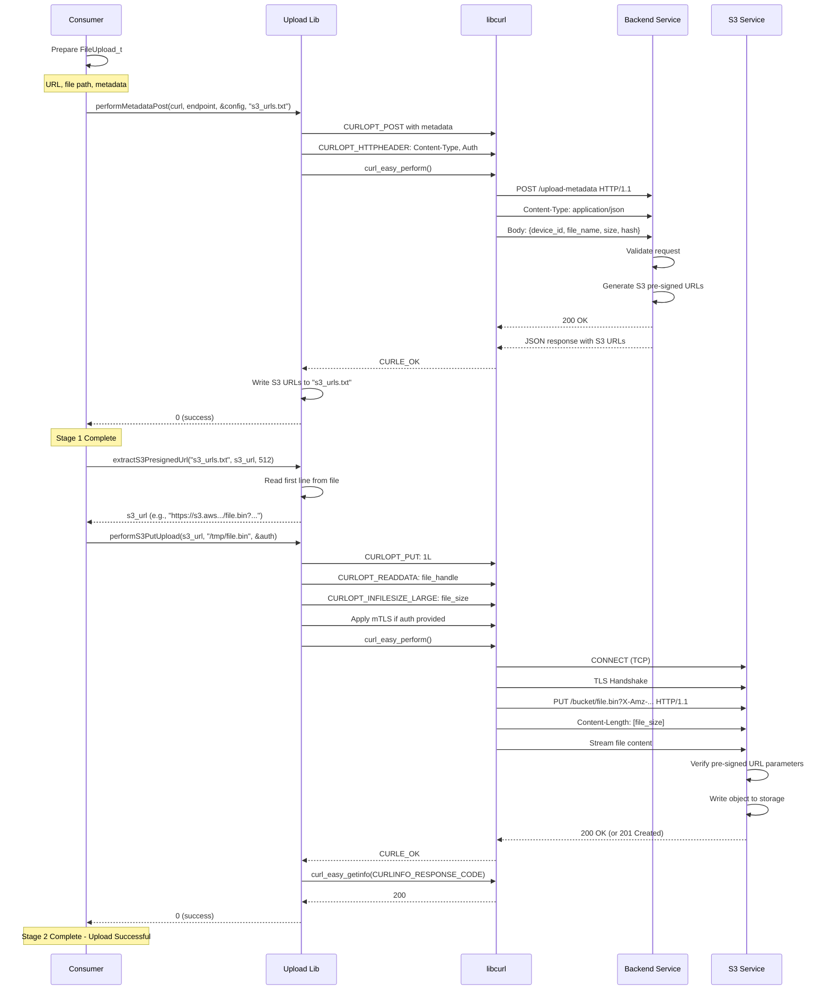
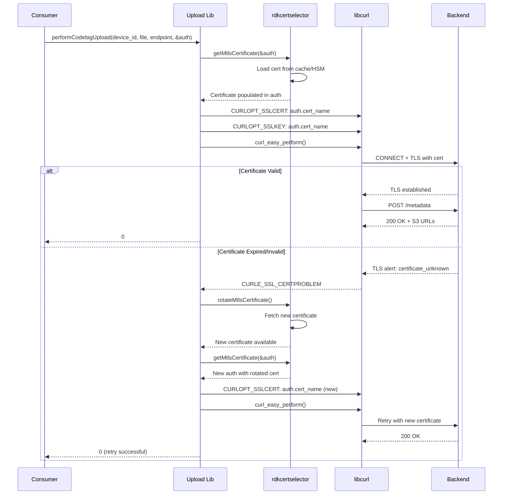
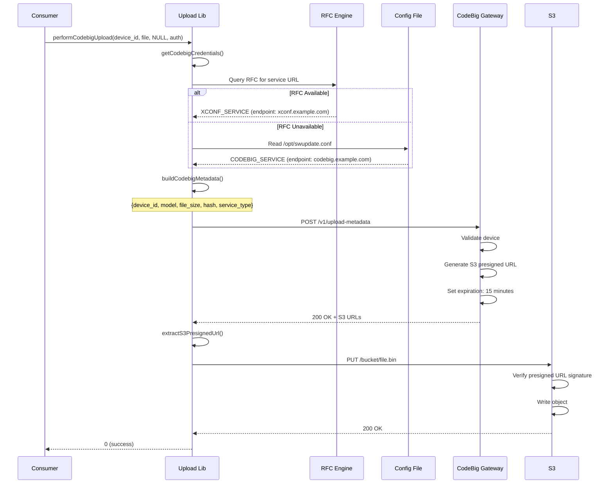

# Upload Operation Sequences - Runtime Flows

**Module:** uploadutils - Upload Library  
**Scope:** HTTP/S3 file upload with two-stage workflow and mTLS support

---

## Sequence Diagram: Standard Two-Stage Upload



---

## Sequence Diagram: Upload with mTLS Certificate Rotation



---

## Sequence Diagram: CodeBig Service Discovery & Upload



---

## State Machine: Upload Session Lifecycle

```
┌─────────────────────────────────────────────────────────────┐
│                    UPLOAD SESSION                            │
└─────────────────────────────────────────────────────────────┘

[INIT]
  │
  └─> doCurlInit() [reused from download library]
      └─> curl* handle ready
          │
          ▼
[METADATA_POSTING]
  │
  ├─> performMetadataPost() called
  │
  ├─> Service discovery:
  │   ├─ Query RFC if available
  │   └─ Fallback to config file
  │
  ├─ Prepare POST request:
  │  ├─ Build metadata JSON
  │  │  └─ {device_id, model, file_name, file_size, hash}
  │  ├─ Set Content-Type: application/json
  │  ├─ Set Authorization header
  │  └─ Apply mTLS if enabled
  │
  ├─ curl_easy_perform()
  │  ├─ TCP connect
  │  ├─ TLS handshake
  │  ├─ POST request send
  │  └─ Receive response
  │
  ├─ HTTP 200/201:
  │  ├─ Parse JSON response
  │  ├─ Extract S3 presigned URLs
  │  ├─ Write URLs to output file
  │  └─ Transition → [URL_READY]
  │
  └─ HTTP error (4xx/5xx):
      └─ Transition → [ERROR]
          │
          ▼
[URL_READY]
  │
  ├─> extractS3PresignedUrl() called
  │
  ├─> Read S3 URL from file
  │
  └─> Transition → [S3_UPLOADING]
      │
      ▼
[S3_UPLOADING]
  │
  ├─> performS3PutUpload(s3_url, file, auth)
  │
  ├─ Open local file
  │
  ├─ Get file size
  │
  ├─ Prepare PUT request:
  │  ├─ CURLOPT_PUT = 1
  │  ├─ CURLOPT_READDATA = file_handle
  │  ├─ CURLOPT_INFILESIZE_LARGE = size
  │  └─ Apply mTLS if auth provided
  │
  ├─ curl_easy_perform()
  │  ├─ TCP connect to S3
  │  ├─ TLS handshake
  │  ├─ PUT request send
  │  └─ Stream file content
  │
  ├─ HTTP 200/201 (Success):
  │  └─ Transition → [COMPLETE]
  │
  ├─ HTTP 403 (Forbidden):
  │  ├─ Likely cause: Pre-signed URL expired (> 15 min)
  │  └─ Transition → [ERROR]
  │
  └─ HTTP 500/503 (Server Error):
      └─ Retry with backoff
          │
          ▼
[COMPLETE]
  │
  └─> Upload successful
      ├─> File persisted in S3
      ├─> Metadata recorded in backend
      └─> doStopUpload() called
          │
          ▼
[ERROR]
  │
  ├─> Error reason logged
  │
  ├─ Possible recovery:
  │  ├─ Retry metadata POST (Stage 1 only)
  │  ├─ Rotate certificate and retry
  │  └─ Back off and try later
  │
  └─> doStopUpload() called
      │
      ▼
[DESTROYED]
```

---

## Error Scenarios & Recovery

### Scenario 1: Presigned URL Expiration

```
Timeline:
0 s:    performMetadataPost() succeeds
        ├─ Backend generates presigned URL: expires at T+900s (15 min)
        └─ URL written to file

450 s:  Consumer calls performS3PutUpload()
        └─ Within 15 min window, URL still valid

900 s:  Consumer calls performS3PutUpload()
        ├─ URL now expired
        ├─ S3 rejects: HTTP 403 Forbidden
        └─ "Access Denied" error
        
Recovery:
1. Retry performMetadataPost() to get fresh URL
2. Use new URL with performS3PutUpload()
```

### Scenario 2: Certificate Rotation During Upload

```
Timeline:
0 s:    getMtlsCertificate() → cert1
        performCodebigUpload() uses cert1

300 s:  Certificate cert1 expires during metadata POST
        ├─ TLS handshake fails: certificate_unknown
        ├─ libcurl returns CURLE_SSL_CERTPROBLEM
        └─ Backend rejects connection

Recovery:
1. Catch CURLE_SSL_CERTPROBLEM
2. Call rotateMtlsCertificate()
3. Call getMtlsCertificate() → cert2 (new)
4. Retry performCodebigUpload() with cert2
```

### Scenario 3: Partial File Upload Failure

```
Problem: Network failure during S3 PUT (50% complete)

Issue: S3 does not support resumable uploads via presigned URLs
       (PUT is atomic; partial writes rejected)

Recovery Options:
1. Retry performS3PutUpload() from start
   ├─ Risks: Pre-signed URL may expire mid-retry
   └─ Solution: Get fresh metadata/URL if retry fails
   
2. Get new presigned URL via performMetadataPost()
   └─ Then retry performS3PutUpload() with new URL
```

---

## Performance Timeline: Large File Upload

```
Timeline (seconds):
0    │ doCurlInit()
     │
1    │ performMetadataPost() starts
     │ ├─ POST small metadata (~100 bytes)
     │ └─ Receive S3 URLs (~500 bytes)
     │
3    │ performMetadataPost() completes
     │ └─ S3 presigned URL ready (valid 15 min)
     │
4    │ extractS3PresignedUrl()
     │ └─ Parse URL from output file
     │
5    │ performS3PutUpload() starts
     │ ├─ Open local file
     │ ├─ TCP connect to S3
     │ ├─ TLS handshake
     │ └─ PUT request sent
     │
10   │ File streaming begins
     │ Throughput: ~5-10 MB/s (S3 typical)
     │
110  │ File transfer complete
     │ Upload of ~500 MB file took ~100 seconds
     │ Effective throughput: ~5 MB/s
     │
111  │ S3 responds: 200 OK
     │
112  │ performS3PutUpload() returns
     │
113  │ doStopUpload() called
     │ Resources cleaned up
     │
Total operation time: ~113 seconds
├─ Metadata phase: ~3 seconds (2%)
└─ Upload phase: ~110 seconds (98%)
```

---

## Memory Usage Timeline

```
Memory utilization during upload:

Phase 1: Initialization (doCurlInit)
├─ libcurl handle: ~8 KB
├─ SSL context: ~16 KB
└─ Internal buffers: ~32 KB
   Total: ~56 KB

Phase 2: Metadata POST (performMetadataPost)
├─ POST data buffer: ~500 bytes
├─ Response buffer: ~1 KB
├─ File handle: ~4 KB (for metadata output)
└─ cURL options: ~4 KB
   Total: ~10 KB

Phase 3: S3 PUT Upload (performS3PutUpload)
├─ File handle: ~4 KB
├─ libcurl upload buffer: ~64 KB (not full file!)
│  (Streaming: chunks uploaded, not entire file in memory)
├─ SSL session: ~16 KB
└─ S3 URL string: ~2 KB
   Total: ~86 KB
   
   Key Point: File is streamed, not buffered entirely
   Memory ~= File handle + curl buffers (~100 KB)
   NOT ~= File size (~500 MB)

Phase 4: Cleanup (doStopUpload)
├─ Close file handle
├─ Free SSL context
├─ Free curl buffers
└─ Total freed: ~50+ KB
   Remaining: ~5 KB

Comparison to Download:
├─ Download: Must buffer entire file in memory
├─ Upload: Streams file from disk
├─ Memory advantage: Upload can handle larger files
```

---

## Bandwidth Utilization

### Typical Upload Pattern

```
Network I/O (bytes/sec):

Metadata POST phase (1-5 seconds):
  ├─ Upstream: 100-200 bytes/sec (metadata only)
  └─ Downstream: 100-200 bytes/sec (S3 URLs, small)

S3 PUT phase (5-110 seconds):
  ├─ Upstream: ~5-10 MB/sec (file streaming to S3)
  │  └─ Limited by: Network bandwidth, S3 regional latency
  └─ Downstream: Minimal (~1 KB/sec status messages)

Total data transferred: ~500 MB (example)
Total time: ~115 seconds
Effective throughput: ~4.3 MB/sec (considering metadata + handshakes)
```

---

## Error Code Reference

### HTTP Status Codes

| Code | Meaning | Action |
|------|---------|--------|
| 200 | OK (metadata POST) | Continue to S3 upload |
| 201 | Created (S3 PUT) | Success |
| 400 | Bad Request | Fix metadata format, retry |
| 403 | Forbidden (S3) | URL expired; get fresh metadata |
| 404 | Not Found | Invalid S3 endpoint; check config |
| 413 | Payload Too Large | File exceeds S3 limit |
| 500-503 | Server Error | Retry with backoff |
| Timeout | Connection timeout | Retry; possibly rotate cert |

### libcurl Error Codes

| Code | Meaning | Recovery |
|------|---------|----------|
| CURLE_OK | Success | Proceed |
| CURLE_COULDNT_CONNECT | Network unreachable | Retry with backoff |
| CURLE_OPERATION_TIMEDOUT | Timeout (30s connection, 2h transfer) | Retry; check network |
| CURLE_SSL_CERTPROBLEM | Certificate invalid | Rotate cert; retry |
| CURLE_SSL_CONNECT_ERROR | TLS handshake failed | Check cert; validate server |
| CURLE_WRITE_ERROR | File I/O failure | Check disk space; file permissions |

---

## References

- AWS S3 Pre-signed URLs: https://docs.aws.amazon.com/AmazonS3/latest/userguide/PresignedUrlUploadObject.html
- HTTP PUT Method: https://tools.ietf.org/html/rfc7231#section-4.3.4
- libcurl Upload Documentation: https://curl.se/libcurl/c/libcurl-tutorial.html
